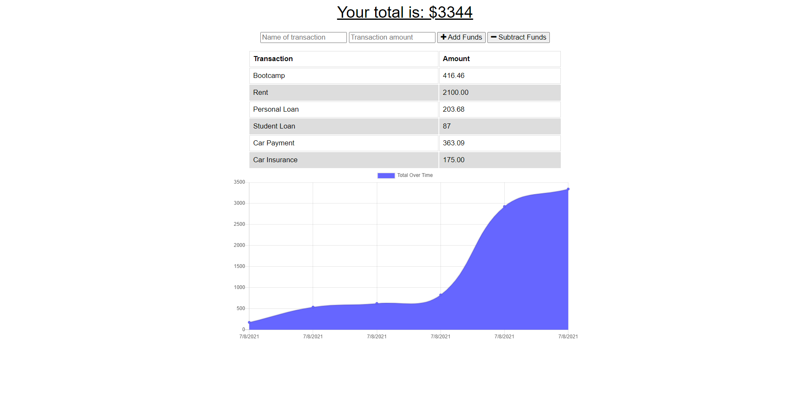

# Budget-Tracker

This week we were tasked with creating a Budget Tracker! This way you will be able to record and keep track of all of your bills in one place.  You are able to add a category and the amount for that category.  It creates a chart so that you are able to visually see what the highest bill you need to budget for will be and what the lowest will be.

## How did I do it?
I used a previous activity to base my file structure off of. I did the service-worker.js file first and then the manifest.webmanifest

## Installation
* Node.js
* Express.js
* Mongoose

## Usage
* VSCode

## Contributors
Kelsea Hunt (technically the Bootcamp as well since we had some starter code)

## Picture of the Finished Application

https://k-ryanhunt.github.io/Budget-Tracker/